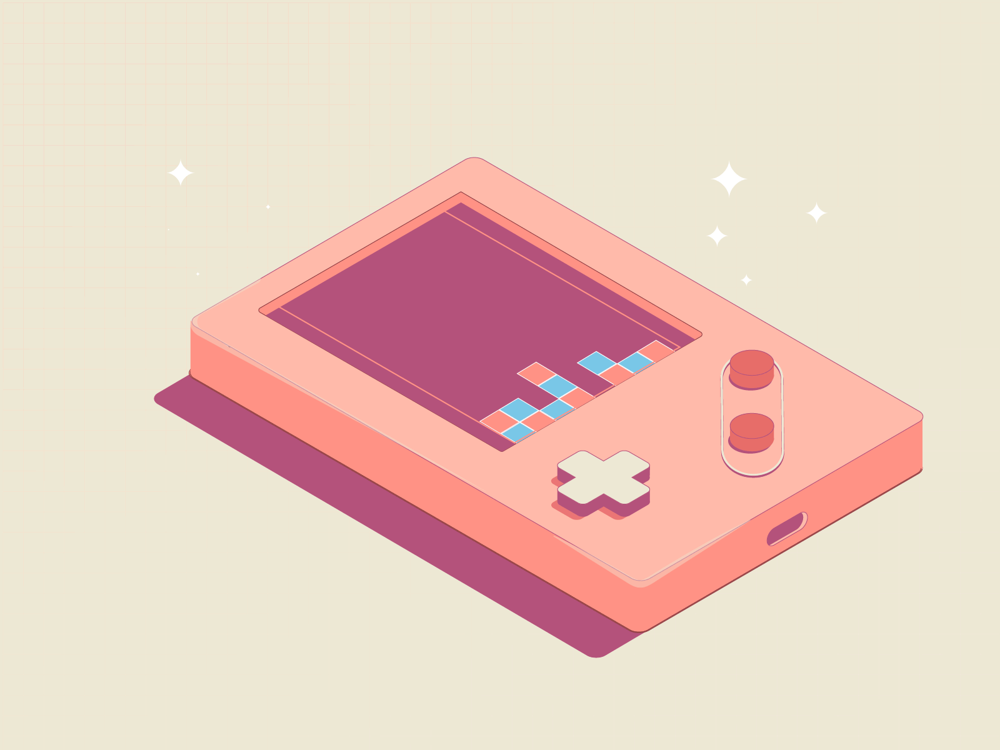

  
  
  

  

  
#  Hi, I'm Senuri Thilakarathne
**Software Engineering Undergraduate | Aspiring UI/UX & Full Stack Developer**

I'm a Software Engineering student who loves turning complex problems into elegant, functional code and intuitive designs.

* 🚀 **Current Focus:**  Building full-stack applications.
* 🎨 **Design-Minded:** UI/UX enthusiast with hands-on experience in Figma, Adobe Suite, and application redesigns focused on user well-being.
* 🌱 **Currently Learning:** Game development! 
> *"Design is not just what it looks like and feels like. Design is how it works."*

 

## 🚀 Tech Stack

### 💻 Programming Languages

### 🌐 Frontend Development

### 🛠️ DevOps & Deployment

### 🔧 Backend & Databases

### 🎨 UI/UX, IDEs & Tools

 

 

## 📊 GitHub Stats

<table width="100%" cellspacing="0" cellpadding="0">
  <tr>
    <td align="center" width="50%" valign="top">
      
    </td>
    <td align="center" width="50%" valign="top">
      
    </td>
  </tr>
</table>

 

 

 

<picture>
  <source media="(prefers-color-scheme: dark)" srcset="https://raw.githubusercontent.com/Senurcreate/Senurcreate/output/github-contribution-grid-snake-dark.svg">
  <source media="(prefers-color-scheme: light)" srcset="https://raw.githubusercontent.com/Senurcreate/Senurcreate/output/github-contribution-grid-snake.svg">
  
</picture>

 

  <h2>👾 Take a break from reading code...</h2>

  
  
 
    
  

  
<i>(Pro tip: Middle-click or hold Ctrl/Cmd while clicking to open in a new tab!)</i>

