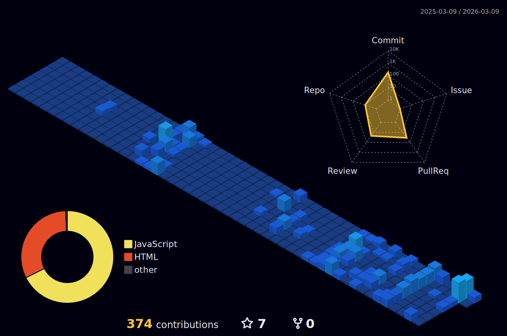

  # Hi,   I'm Senuri Thilakarathne
   
  

    

  
🚀 **Current Focus:**  Building full-stack applications.  
🎨 **Design-Minded:** UI/UX enthusiast with hands-on experience in Figma & Adobe Suite. 
🌱 **Currently Learning**: Game development!  

 

 
## 🚀 Tech Stack
 

  

 
## 📊 GitHub Stats

  <table width="100%">
    <tr>
      <td width="50%" align="center">
        
      </td>
      <td width="50%" align="center">
        
      </td>
    </tr>
  </table>

   

  

 

  <h2>👾 Take a break...</h2>
  
    
  

  
<i>(Pro tip: Middle-click or hold Ctrl/Cmd while clicking to open in a new tab!)</i>

---

 

  

