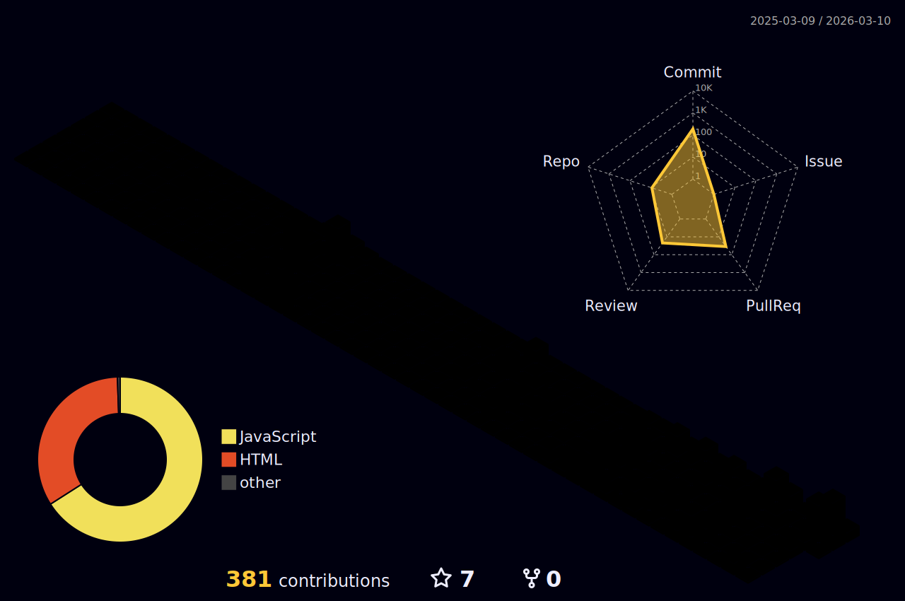

  
  # Hi,   I'm Senuri Thilakarathne
   
  

    
  

  
  ## 🌿 About Me
  I enjoy designing intuitive interfaces and turning ideas into real, usable products. Currently diving deeper into full-stack architecture while refining my UI/UX thinking.  
  🚀 Full-Stack Developer in progress  
  🎨 UI/UX Designer at Heart 
  🛠️ Java | MERN | SQL 
  🌱 Focused on building impactful digital experiences  

 

 
## 🚀 Core Stack
 

  

 

## 🧰 Technologies & Tools
<!-- 

) -->

  
   
  

  

 
## 📊 GitHub Stats

  <table width="80%">
    <tr>
      <td width="50%" align="center">
        
      </td>
      <td width="50%" align="center">
        
      </td>
    </tr>
  </table>

   

  

  

  <h2>👾 Take a break...</h2>
  
    
  

  <em>(Pro tip: Middle-click or hold Ctrl/Cmd while clicking to open in a new tab!)</em>

   
*✨ Designing and building with intention. ✨*
  

---

  Licensed under <a href="LICENSE">MIT</a> © 2026 Senuri Thilakarathne

